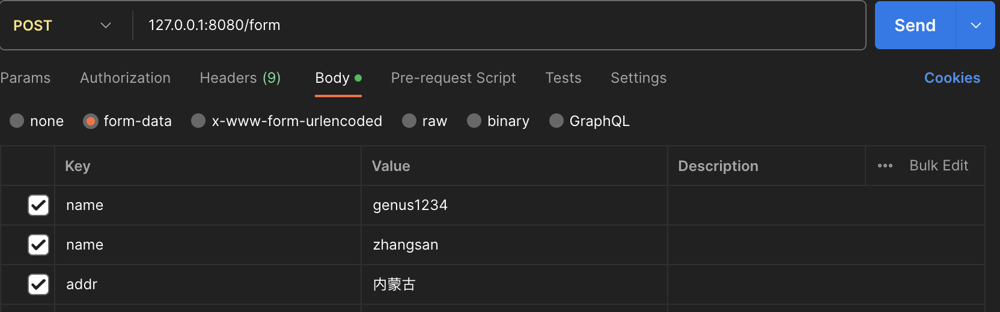

# GinStudy

### 1. 响应
1. 创建一个默认路由

```go
// 创建一个默认路由
router := gin.Default()
```
2. 绑定路由规则和路由函数，访问/index的路由，将由对应的函数去处理
```go
router.GET("/index", func(c *gin.Context) {
	// 状态码，用于返回状态
	c.String(http.StatusOK, "hello world")
})
```
3. 启动监听
启动监听，gin会把web服务启动在本机的0.0.0.0:8080端口上
```go
// 启动方式1
router.Run(":8080")
// 启动方式2，用原生http启动,router.Run()本质就是http.ListenAndServe进一步封装
http.ListenAndServe(":8080", router)

```
4. 响应json、xml、yaml数据
 ```go
router.GET("/json", func(c *gin.Context) {
    // json响应结构体
    type UserInfo struct {
    Username string `json:"username"`
    Age      int    `json:"age"`
    Password string `json:"-"` // 不要转换为字符串
    }
    userInfo := UserInfo{Username: "user", Age: 18, Password: "123456"}
    c.JSON(200, userInfo)
    // json响应map
    var p1Info = map[string]interface{}{
    "p1Name":      "p1",
    "p1Age":       12,
    "p1Passworld": "123456",
    }
    c.JSON(200, p1Info)
    // 直接响应json
    c.JSON(200, gin.H{"json_name": "json", "age": 18, "password": 123456})
    
    })
    // 响应xml
    router.GET("/xml", func(c *gin.Context) {
    c.XML(http.StatusOK, gin.H{"xml_name": "xml", "age": 18, "password": "123456"})
})
// 响应yaml
router.GET("/yaml", func(c *gin.Context) {
c.YAML(http.StatusOK, gin.H{"yaml_name": "yaml", "age": 18, "password": "123456"})
})
```
5. 加载html文件和静态文件
```go
// 加载模版目录下的所有目录文件
router.LoadHTMLGlob("templates/*")
// 加载静态文件目录下所有静态文件
// 在go中没有相对文件的路径，只有相对项目的路径
router.StaticFile("/static/screen.jpg", "./static/screen.jpg")
// 响应html
router.GET("/html", func(c *gin.Context) {
    c.HTML(http.StatusOK, "index.html", gin.H{})
})
```
6. 重定向
```go 
// 重定向
/*
    重定向301和302的区别
    301:表示资源已被永久移动到新的位置，客户端和搜索引擎应使用新的 URL 来访问资源。
    302:表示资源暂时被移动到另一个位置，客户端应继续使用旧的 URL 访问资源。
*/
router.GET("/baidu", func(c *gin.Context) {
    c.Redirect(http.StatusMovedPermanently, "http://www.baidu.com")
})
```

### 2. 请求
1. 查询参数
```url
?id=1&user=genus&user=dog
```
```go
// 请求
// 查询请求
router.GET("/query", func(c *gin.Context) {
    // 返回查询参数
    user1 := c.Query("user")
    // 返回查询参数和查询结果
    user2, ok := c.GetQuery("user")
    // 返回同一参数的多个查询结果
    user3, ok := c.GetQueryArray("user")
    // 略：user4, ok := c.GetQueryMap("user")
    if !ok {
        fmt.Println("para is null ")
    } else {
        fmt.Println("user is: ", user1, user2, user3)
    }
})
```
2. 动态参数
```go
param/123xxx/456
```
```go
// 动态参数
router.GET("/param/:user_id/:book_id", func(c *gin.Context) {
    userid := c.Param("user_id")
    bookid := c.Param("book_id")
    fmt.Printf("user id is %v ,book id is %v\n", userid, bookid)
})
```
3. 表单PostForm

可以接受multipart/form-data和application/x-www-form-urlencoded
   
 ```go
// 表单参数
router.POST("/form", func(c *gin.Context) {
    fmt.Println("name is ", c.PostForm("name"))
    fmt.Println("names are ", c.PostFormArray("name"))
    fmt.Println("default form is ", c.DefaultPostForm("addr", "0.0.0.0"))
    // 接受所有的form，包括文件
    multi, err := c.MultipartForm()
    fmt.Println("multiform is ", multi, err)
})
```
4. 原始参数
```go
// form-data:
----------------------------811858931537583816385214
Content-Disposition: form-data; name="name"

genus1234
----------------------------811858931537583816385214
Content-Disposition: form-data; name="name"

zhangsan

// x-www-form-urlencoded
name=zhangsan&age=18


```
```go
// 原始参数
router.POST("/raw", func(c *gin.Context) {
   body, _ := c.GetRawData()
   header := c.GetHeader("content-type")
   // json解析原始参数
   type User struct {
   Name string `json:"name"`
   Age  int    `json:"age"`
   }
   var user User
   err := json.Unmarshal(body, &user)
   if err != nil {
   return
   }
   fmt.Println(header, string(body), user)
})
```

### 3. 四大请求方式
GET：从服务器取出资源（一项或多项）
   
POST：在服务需新建一个资源

PUT：在服务器更新资源（客户端提供完整资源数据）

PATCH：在服务器更新资源（客户端提供需要修改的资源数据）

DELETE：从服务器删除资源

```go
// 以文字资源为例
// GET    /articles        访问文章列表
// GET    /articles/:id    文章详情
// POST   /articles        添加文章
// PUT    /articles/:id    修改某一篇文章
// DELETE /articles/:id    删除某一篇文章
```